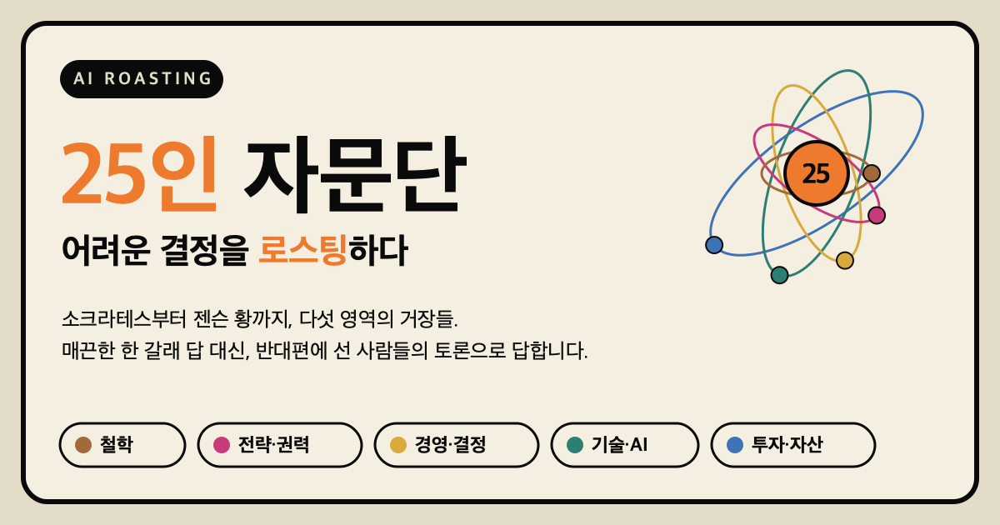

# AI ROASTING 자문단

<p align="center">
  <a href="https://airoasting-council.vercel.app/"></a>
</p>

<p align="center">
  
  
  
  
  
</p>

> 고개만 끄덕이는 자문단은 잊으세요. 25인의 거장이 당신의 결정을 로스팅합니다.
>
> 까려는 게 아닙니다. 밀어붙이기 전에 가장 강한 반대를 미리 듣는 자리입니다.

정면 진입, 조직 개편, 인수, 핵심 인재를 붙잡을지 보낼지. 혼자 떠안은 큰 결정 앞에서 씁니다.

소크라테스, 이순신, 드러커, 머스크, 버핏을 한자리에 불러 어려운 결정을 토론에 부치는 도구입니다. `/council` 명령 한 줄이면 25명의 전문가가 서로 다른 자리에서 같은 문제를 바라보고, 부딪치고, 끝내 합의되지 않은 지점을 먼저 알려줍니다.

좋은 결정은 매끄러운 한 줄의 답에서 나오지 않습니다. 서로 반대편에 선 사람들이 같은 문제를 두고 충분히 다툰 뒤에 남는 것, 그 남은 것에서 나옵니다. 이 자문단은 그 다툼을 구조로 만들어 줍니다.

## 무엇이 다른가

### 인격을 끝까지 다듬었습니다

25명은 한 번에 써 내려간 프롬프트가 아닙니다. 각 인격은 초안을 쓴 뒤 여러 관점의 비평으로 약점을 들춰내고, 9.7점이라는 합격선을 넘길 때까지 다시 쓰기를 반복해 다듬었습니다. 그래서 말을 흐리지 않습니다. 저마다 자기 기준으로 분명한 결론을 냅니다. AI ROASTING이라는 이름은 여기서 나왔습니다. 인격은 혹독한 검증을 거쳐 다듬어졌고, 회의에 올라온 결정 역시 같은 방식으로 검증을 받습니다.

### 한국 경영 리더를 염두에 두고 짰습니다

이순신과 정약용이 들어가 있습니다. 이순신은 자원이 부족하고 물러설 수 없는 자리에서 준비와 규율로 판을 뒤집는 실행을 봅니다. 정약용은 현장의 데이터와 청렴이라는 잣대로, 좋은 의도가 정말 가장 약한 사람에게 닿는지를 묻습니다. 나머지도 드러커, 머스크, 알트만, 버핏, 멍거, 캐시 우드처럼 한국 리더가 바로 떠올리는 이름으로 채웠습니다.

### 다섯 영역을 고르게 갖췄습니다

철학, 전략과 통치, 경영과 의사결정, 기술과 AI, 투자와 자산. 다섯 영역에 정확히 다섯 명씩 두었고, 같은 영역 안에서도 서로 다른 렌즈가 부딪치게 배치했습니다. 투자와 자산을 한 영역으로 세운 덕에 인수나 투자 판단을 그 자리에서 다룰 수 있고, 동시대 AI 리더 다섯 명이 있어 기술 의사결정도 현재 시점의 언어로 토론합니다.

### 일부러 반대편끼리 묶었습니다

같은 말을 반복하는 회의는 시간 낭비입니다. 그래서 전문가를 의도적으로 대척점에 세웠습니다. 정약용과 마키아벨리는 권력을 어떻게 써야 하는지를 두고 정면으로 갈립니다. 크리스텐슨은 왜 무너지는가를, 콜린스는 어떻게 오래 가는가를 봅니다. 머스크와 알트만의 속도를 아모데이의 신중이 붙잡고, 버핏과 멍거의 가치를 캐시 우드의 성장이 흔듭니다.

### 지어내지 않고, 결론을 미루지 않습니다

모든 인격에는 두 가지 규칙이 박혀 있습니다. 하나는 사고방식은 빌리되 정본에 없는 발언이나 숫자, 일화는 만들어내지 않는다는 것입니다. 살아 있는 인물에게는 이 규칙을 더 엄격하게 적용합니다. 다른 하나는 모든 판단을 세 갈래로 나누어 분명한 경계와 함께 내놓는다는 것입니다. 토론이 미사여구로 흐르지 않고 입장으로 모입니다.

## 25명의 전문가

| 영역 | 전문가 |
|------|------|
| 철학과 관점 | 소크라테스, 아리스토텔레스, 마르쿠스 아우렐리우스, 노자, 알프레드 아들러 |
| 전략과 통치, 권력 | 손자, 클라우제비츠, 마키아벨리, 이순신, 정약용 |
| 경영과 의사결정 | 피터 드러커, 대니얼 카너먼, 나심 탈레브, 클레이튼 크리스텐슨, 짐 콜린스 |
| 기술과 AI | 일론 머스크, 샘 알트만, 다리오 아모데이, 데미스 하사비스, 젠슨 황 |
| 투자와 자산 | 워런 버핏, 찰리 멍거, 캐시 우드, 레이 달리오, 하워드 막스 |

각 전문가의 정의는 `agents/` 폴더에 영어 문서로 들어 있습니다. 한 파일 안에 그 인물의 정체, 첫 질문, 핵심 원칙, 분석 순서, 결정 규칙, 환각 방지 규칙, 다른 전문가와의 관계, 실제 적용 예시가 담겨 있습니다.

## 토론 모드

| 모드 | 명령 | 언제 쓰나 |
|------|------|-----------|
| 전체 (기본) | `/council [문제]` | 세 라운드로 깊게 토론합니다. 결정이 무겁고 의견이 갈릴 때 |
| 빠른 | `/council --quick [문제]` | 두 라운드로 빠르게 읽습니다. 상대적으로 가벼운 결정 |
| 듀오 | `/council --duo [문제]` | 대척점에 선 두 사람만 붙입니다. 하나의 긴장을 파고들 때 |
| 트라이어드 | `/council --triad <이름> [문제]` | 문제 유형에 맞춘 세 명을 부릅니다 |
| 전문가 지정 | `/council --members 이순신,정약용,마키아벨리 [문제]` | 원하는 인물만 부릅니다 |

미리 정해 둔 트라이어드로는 `strategy`, `crisis`, `governance`, `decision`, `innovation`, `endurance`, `ai`, `ai-infra`, `investing`, `macro`, `ethics`, `framing`, `systems`가 있습니다.

## 설치

```bash
./install.sh
```

`install.sh`가 25개 에이전트를 `~/.claude/agents/`에, `/council` 스킬을 `~/.claude/skills/council/`에 설치합니다. 설치가 끝나면 Claude Code를 다시 시작합니다(터미널을 닫고 다시 열거나, 새 `claude` 세션을 시작하면 됩니다).

다시 시작했으면 첫 명령으로 이렇게 쳐보세요. 처음엔 모드 없이 질문만 던지면 됩니다.

```
/council 우리가 지금 가장 망설이는 결정은 무엇이고, 무엇을 놓치고 있을까요?
```

미리 확인하거나 다른 위치에 설치하려면 다음 옵션을 씁니다.

```bash
./install.sh --dry-run            # 실제로 쓰지 않고 미리 봅니다
./install.sh --claude-dir PATH    # 다른 Claude 설정 폴더에 설치합니다
```

## 사용 예시

```
/council 후발 주자로 대기업과 같은 시장에 정면 진입해야 할까요?
/council --triad investing 이 회사를 지금 인수할 만한가요?
/council --duo 마이크로서비스와 모놀리식, 지금 단계에서 어느 쪽이 맞을까요?
/council --quick 이번 분기에 출시해도 될까요?
/council --members 이순신,정약용,마키아벨리 이 조직 개편을 강행해야 할까요?
```

결과는 매끈한 합의가 아니라 갈라진 지점을 먼저 보여줍니다. 예를 들어 `/council 경쟁사가 우리 핵심 기능을 베꼈습니다. 소송할까요, 더 빨리 혁신해 앞서갈까요?`를 던지면 이렇게 나옵니다.

```
## AI ROASTING 종합 의견

전문가들의 표결: 혁신 속도로 앞서가라 2명(손자, 일론 머스크), 발판부터 확인하라 1명(마키아벨리), 질문이 틀렸다 1명(클레이튼 크리스텐슨)

서로 엇갈린 지점
- 손자, 일론 머스크: 지금 바로 다음 버전을 내라. 법정은 그들이 고른 싸움터다.
- 마키아벨리: 달리기 전에 발판부터 보라. 고객이 떠나는 중이면 그 흐름부터 막아라.
- 클레이튼 크리스텐슨: 둘 다 틀린 질문이다. 진짜 위협은 정면 경쟁사가 아니라 더 싸고 단순한 제품으로 아래에서 올라오는 새 업체다.

전문가들이 동의한 지점: 소송만으로는 못 이긴다. 이겨도 법원이 주는 건 과거 배상뿐이고, 시장 주도권은 돌아오지 않는다.

멈춰야 할 신호: 혁신 속도가 소송 속도보다 느리다. 그러면 법원에서 이겨도 시장에서 진다.

첫번째 행동: 소송부터 걸지 말고, 고객이 지금 떠나는 중인지와 더 싸고 단순한 새 업체가 아래에서 올라오는지부터 확인한다. 머물고 그런 위협이 없으면 다음 버전 출시 속도를 최대로 올린다.

AI ROASTING의 최종 조언: 가장 센 대립은 "지금 달려라"와 "발판부터 보라"지만, 넷 다 "소송 하나로는 못 이긴다"에서 만난다. 이걸 뒤집으려면 소송으로 경쟁사 출시를 1년 넘게 막는다는 법률 검토가 있어야 한다.
```

## 작동 방식

`/council`을 부르면 코디네이터가 문제를 보고, 서로 다른 영역과 대척점을 가로지르도록 다섯에서 일곱 명을 고릅니다. AI 리더들은 관점이 겹치므로 한 번에 두세 명까지만 앉힙니다. 누구를 왜 불렀는지 먼저 밝힌 뒤, 고른 전문가를 각각 서브에이전트로 띄워 자기 정의를 따르게 합니다.

분석에 들어가기 전에는 모든 전문가가 문제를 한 문장으로 다시 진술하는 관문을 거칩니다. 두 명 이상이 문제를 서로 다르게 진술하면 그 자리에서 멈춥니다. 질문 자체가 잘못된 것일 수 있으니, 더 나은 질문을 먼저 제안합니다.

## 결정이 쌓입니다

자문단은 매 토론을 프로젝트 루트의 `MEMORY.md`에 짧게 기록합니다. 다음에 비슷한 결정을 가져오면, 지난번 자문단이 무엇을 경고했는지 먼저 떠올려 이번 토론에 넣습니다.

> 석 달 전 같은 시장 진입을 물었을 때, 이 자문단은 "함대를 깨는 정면전"이라고 경고했습니다. 오늘 다시 같은 맹점이 보입니다.

일회성 답이 아니라, 당신의 의사결정 기록으로 남습니다. `MEMORY.md`에는 이렇게 한 건씩 쌓입니다.

```
## 2026-04-01 경쟁사가 핵심 기능을 베꼈다. 소송할까, 더 빨리 혁신할까?
- 모드: 전체 | 전문가: 손자, 일론 머스크, 마키아벨리, 클레이튼 크리스텐슨
- 표결: 혁신 속도로 앞서가라 2명, 발판부터 보라 1명, 질문이 틀렸다 1명
- 종합: 소송만으로는 못 이긴다. 다음 버전 출시 속도부터 확인하라.
- 미해결: 혁신 속도가 소송 속도보다 느리면?
```

## 라이선스

MIT 라이선스를 따릅니다. 자유롭게 쓰고, 고치고, 배포할 수 있습니다. 자세한 내용은 `LICENSE` 파일을 참고하시기 바랍니다.
